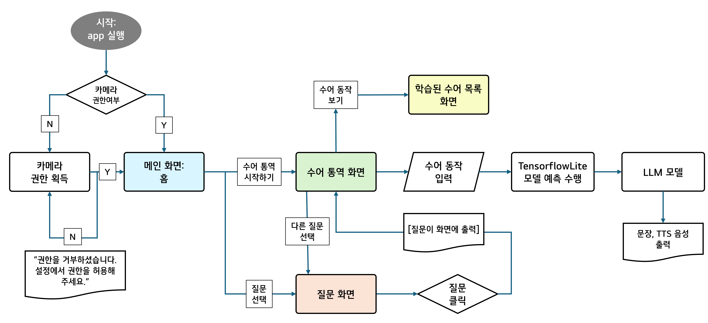
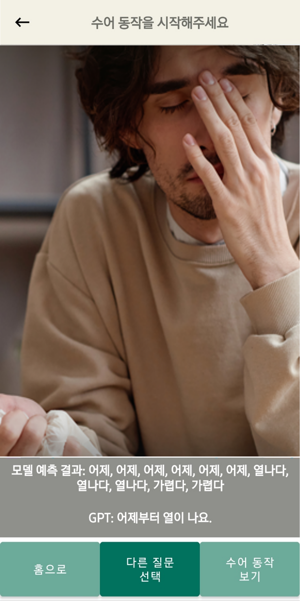
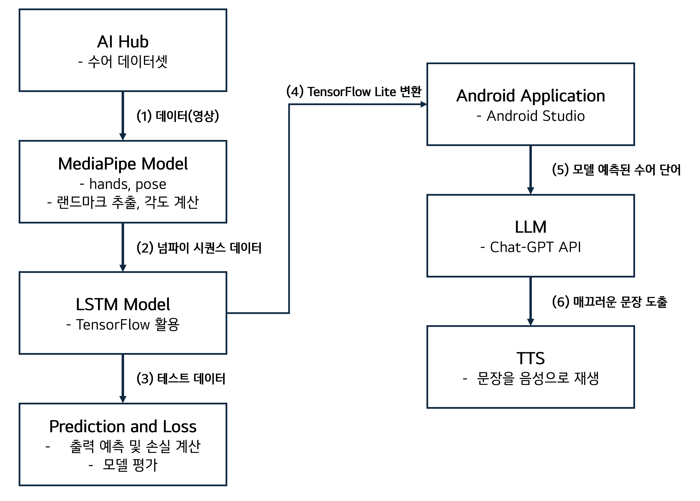
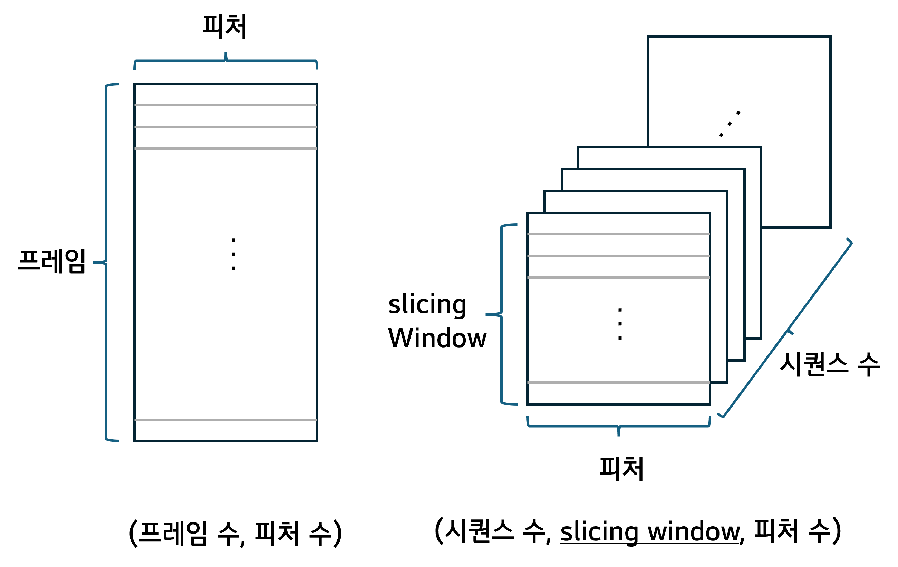
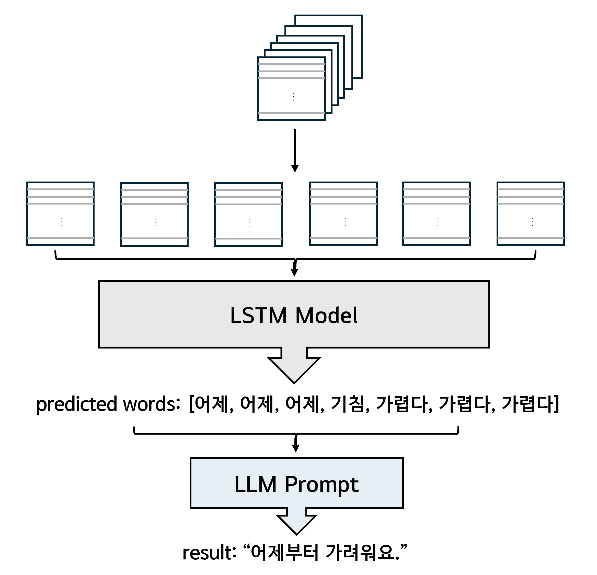

## 의료기관용 수어 통역 애플리케이션

## Flow Chart

## UI

  
  
  
  
  

## 전체 시스템 구조

- sign-language-detect-model
1) Google의 MediaPipe를 활용하여 손과 포즈 랜드마크의 3차원 좌푯값 추출
2) 각 관절 사이의 각도 값을 계산하여 생성한 2차원 데이터를 시퀀스(시계열) 데이터로 변환 후 LSTM 레이어를 통한 수어 단어 학습
3) 촬영한 테스트 데이터를 바탕으로 모델 평가

- *android-sign-language-detector*
4) LSTM 모델을 TensorFlow Lite로 변환하여 Android 환경에 포팅
5) 모델을 통해 인식된 수어를 ChatGPT API를 통하여 자연스러운 문장으로 변환
6) TTS(Text to Speech)로 의료진에게 음성으로 전달

## 데이터 구조

- 손의 21개의 랜드마크와 포즈의 21개의 랜드마크 좌푯값 추출
- arccos 함수를 이용해 각 관절 사이의 각도를 계산
- 좌푯값과 각도값을 합한 총 234개의 피처에 레이블을 추가해 총 235개의 피처를 2차원 배열 형태로 매 프레임마다 추출
- 3차원 시퀀스 형태의 데이터로 변환

## 모델 예측 및 문장 생성 알고리즘

- 모델을 통해 예측된 단어를 예측 리스트에 추가
- 3번 이상 같은 단어를 예측했다면 정답인 것으로 간주
- ChatGPT API를 활용해 자연스러운 문장으로 변환

## 시연 영상
https://youtu.be/AGBR57R2nm8
